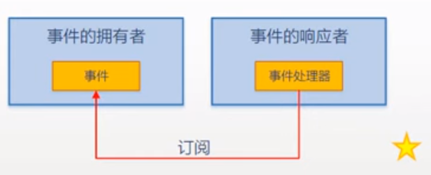

## 1.2_事件案例_2

案例2：
- 情形1：事件的拥有者与事件的响应者不同，且独立存在
- 本例是 MVC 框架的原型



**事件5步法：**
1. 找事件拥有者
2. 找事件
3. 找事件响应者
4. 找事件处理器
5. 找事件订阅关系

```cs
class Program
{
    static void Main(string[] args)
    {
        //1. form：事件拥有者
        Form form = new Form();

        //3. controller：事件响应者
        //注：由这句可以看出，即使没有用到响应者的其他成员，响应者的实例也必须存在(占资源)，不然用不了事件。这是从委托遗留下来的缺点之一
        Controller controller = new Controller(form);   
        form.ShowDialog();
    }
}

class Controller
{
    private Form form;

    public Controller(Form form)
    {
        if(form != null)
        {
            this.form = form;
            //2. Click：事件
            //5. 事件订阅关系(语句)
            this.form.Click += this.FormClicked;
        }
    }

    //4. 事件处理器
    private void FormClicked(object sender, EventArgs e)
    {
        //将窗口标题栏文本改为现在的时间
        this.form.Text = DateTime.Now.ToString();
    }
}
```