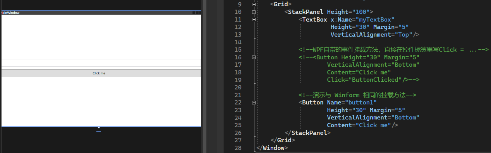

## 1.6_WPF事件案例_6


```xaml
<Grid>
    <StackPanel Height="100">
        <TextBox x:Name="myTextBox"
                    Height="30" Margin="5"
                    VerticalAlignment="Top"/>

        <!--WPF自带的事件挂载方法，直接在控件标签里写Click = ...-->
        <!--<Button Height="30" Margin="5"
                VerticalAlignment="Bottom"
                Content="Click me"
                Click="ButtonClicked"/>-->

        <!--演示与 Winform 相同的挂载方法-->
        <Button Name="button1"
                Height="30" Margin="5"
                VerticalAlignment="Bottom"
                Content="Click me"/>
    </StackPanel>
</Grid>
```

后台代码：
```cs
public partial class MainWindow : Window
{
    public MainWindow()
    {
        InitializeComponent();
        //现代方法
        //this.button1.Click += this.ButtonClicked;

        //老式方法
        /*
            * 注：这里用的是 RoutedEventHandler() 与 Winform 的不同，因为 WPF 使用的叫做路由事件
            */
        this.button1.Click += new RoutedEventHandler(this.ButtonClicked);
    }

    //注意参数名 RoutedEventArgs 与 Winform 项目不同
    private void ButtonClicked(object sender, RoutedEventArgs e)
    {
        this.myTextBox.Text = "Hello WASPEC";
    }
}
```
关于路由事件的补充：
```cs
/*
* 补充：
* 定义：WPF的路由事件是一种特殊的事件类型，它可以在元素树中的多个元素上触发和处理，而不仅仅是在事件源上。
* 
* 种类：路由事件有三种路由策略，分别是冒泡、隧道和直接。
*      1. 冒泡路由事件是从事件源向上沿着元素树传递，直到根元素或者被处理为止。
*      2. 隧道路由事件是从根元素向下沿着元素树传递，直到事件源或者被处理为止。
*      3. 直接路由事件只在事件源上触发，不会传递给其他元素。
*      
* 实现：路由事件可以通过EventManager类注册、添加、移除和触发，也可以通过CLR事件包装器实现。
* 
* 优点：是可以实现控件组合和封装，提供单一处理程序附件点，支持类处理和无反射的事件引用。
* 
*/
```