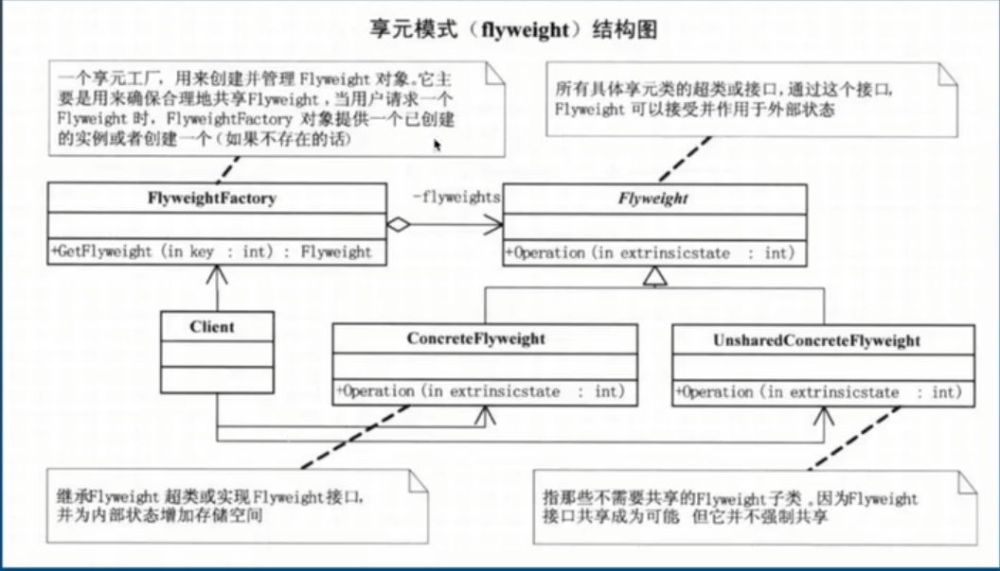

## 享元设计模式

享: 共享  
元: 元素 --> 即对象

- 当系统中大量使用某些相同或相似的对象, 这些对象会消耗大量资源,
- 并且这些对象剔除外部状态后可以通过同一个对象来替代, 这时可以用享元设计模式来解决

内部状态: 对象内部不受环境改变的部分

外部状态: 随着环境的变化而变化的部分

例如: 
- 共享单车的使用状态、二维码等是内部状态
- 而骑车的用户就是外部状态

**运用共享技术有效的支持大量细粒度的对象**
优点: 通过对象的复用, 减少对象的数量, 节省内存
缺陷: 需要分类对象的内外部状态, 提高系统复杂度

享元设计模式与单例设计模式的区别:
1. 单例设计模式不考虑内、外部状态
2. 单例设计模式有且仅有一个对象, 享元设计模式的对象可以有很多(仍然能避免创建超多对象, 如线程池内有10个线程, 所有用户都能使用, 不够就创, 但可设置上限1000个)

### 池技术就是享元设计模式的体现(对象池、线程池、数据库连接池等)



#### 以下为共享单车案例:
- 总共只有3辆车, 车子行驶中时不能获取
- 车子归还后可以被其他乘客获取

```cs
static void Main(string[] args)
{
    //共享单车案例

    //创建享元工厂对象
    BikeFactory bikeFactory = new BikeFactory();

    FlyweightBike flyweightBike = bikeFactory.GetBike();
    flyweightBike.Ride("张三");

    FlyweightBike flyweightBike2 = bikeFactory.GetBike();
    flyweightBike2.Ride("李四");
    flyweightBike2.Back("李四");  //李四骑完车后将车归还

    FlyweightBike flyweightBike3 = bikeFactory.GetBike();
    flyweightBike3.Ride("王五");

    FlyweightBike flyweightBike4 = bikeFactory.GetBike();
    flyweightBike4.Ride("赵六");
}

public abstract class FlyweightBike
{
    //内部状态: BikeID State: 0 -> 锁定中, 1 -> 骑行中
    //外部状态: 用户

    public string BikeID { get; set; }

    public int State { get; set; }

    public abstract void Ride(string userName);

    public abstract void Back(string userName);
}

public class YellowBike : FlyweightBike
{
    public YellowBike(string id)
    {
        this.BikeID = id;
    }

    public override void Ride(string userName)
    {
        this.State = 1;
        Console.WriteLine("用户" + userName + "正在骑行ID是: " + this.BikeID + "的小黄车");
    }

    public override void Back(string userName)
    {
        this.State = 0;
        Console.WriteLine("用户" + userName + "归还了ID是: " + this.BikeID + "的小黄车");
    }
}

public class BikeFactory
{
    List<FlyweightBike> bikePool = new List<FlyweightBike>();
    public BikeFactory()
    {
        //这里往池子里添加3辆车(数量可改)
        for(int i = 0;i < 3;i++)
        {
            bikePool.Add(new YellowBike(i.ToString()));
        }
    }

    public FlyweightBike GetBike()
    {
        //如果池子里还有车就能拿出来, 如果没有车了则返回null
        for(int i = 0; i < bikePool.Count; i++)
        {
            if (bikePool[i].State == 0)
            {
                return bikePool[i];
            }
        }
        return null;
    }
}
```