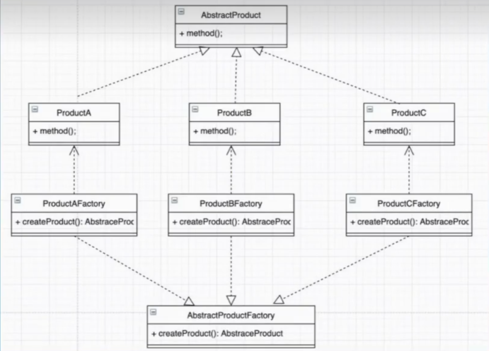

## 0_抽象工厂模式引入

- 回顾一下简单工厂和工厂, 找出缺陷, 引出抽象工厂



1. 简单工厂设计模式    
- 缺陷：     
    1). 将所有创建对象的事情都放在一个类中, 如果这个类崩溃了, 则整个系统都会崩溃  
    2). 抽象严格依赖于细节, 不符合依赖倒置原则

2. 工厂设计模式
- 缺陷: 每有一个子类, 都要有一个用于创建子类的工厂类, 工厂类太多导致类数量爆炸 

3. 抽象工厂设计模式
- 解决工厂类数量爆炸的问题
```cs
//创建不同品牌的键盘
public interface IKeyboard
{
    void ShowBrand();
}

public class DellKeyboard : IKeyboard
{
    public void ShowBrand()
    {
        Console.WriteLine("我是Dell品牌的键盘");
    }
}

public class LenovoKeyboard : IKeyboard
{
    public void ShowBrand()
    {
        Console.WriteLine("我是Lenovo品牌的键盘");
    }
}

public class HPKeyboard : IKeyboard
{
    public void ShowBrand()
    {
        Console.WriteLine("我是惠普品牌的键盘");
    }
}

/*
* 1. 简单工厂设计模式
* 缺陷：   1). 将所有创建对象的事情都放在一个类中, 如果这个类崩溃了, 则整个系统都会崩溃
*         2). 抽象严格依赖于细节, 不符合依赖倒置原则
*/
public class KeyboardFactory
{
    public static IKeyboard GetKeyboard(string brand)
    {
        IKeyboard keyboard = null;
        switch(brand)
        {
            case "Dell":
                keyboard = new DellKeyboard();
                break;
            case "Lenovo":
                keyboard = new LenovoKeyboard();
                break;
            case "HP":
                keyboard = new HPKeyboard();
                break;
            default:
                break;

        }
        return keyboard;
    }
}

/*
* 2. 工厂设计模式
* 缺陷: 每有一个子类, 都要有一个用于创建子类的工厂类, 工厂类太多导致类数量爆炸
*/
public interface IKeyboardFactory
{
    IKeyboard GetKeyboard();
}

public class DellFactory : IKeyboardFactory
{
    public IKeyboard GetKeyboard()
    {
        return new DellKeyboard();
    }
}

public class LenovoFactory : IKeyboardFactory
{
    public IKeyboard GetKeyboard()
    {
        return new LenovoKeyboard();
    }
}

public class HPFactory : IKeyboardFactory
{
    public IKeyboard GetKeyboard()
    {
        return new HPKeyboard();
    }
}
```
