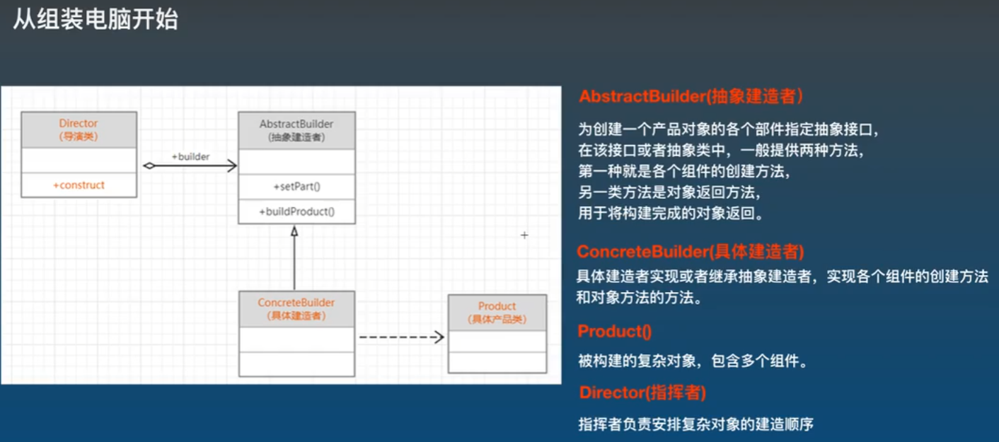

## 建造者设计模式


 
对象:
1. 被建造类: 被建造的复杂对象
2. 抽象建造者: 封装好整个建造过程所需方法
3. 具体的建造者: 实现各建造方法的具体业务
4. 导演类: 将执行整个建造过程按指定的先后顺序封装成方法

客户端执行过程:
1. 根据要建造对象的类型, 实例化不同的实现类(具体的建造者)
2. 实例化导演类
3. 调用导演类封装好的方法, 实现类(具体的建造者)作为参数传入
4. 此时创建好的对象已存入实现类(具体的建造者)的属性中, 拿出即可

```cs
static void Main(string[] args)
{
    IConstructorComputer C1 = new GoodComputer();       //1. 创建了两个建造者对象
    IConstructorComputer C2 = new BadComputer();        
    Directory directory = new Directory();              //2. 创建了导演对象

    //让b1这个具体的建造者, 按照指定的顺序进行复杂对象的创建
    directory.ConstuctComputer(C1);                     //3. 导演对象按照指定顺序, 调用建造者对象的方法 -> 建造者对象中含有被建者的依赖, 调用方法时为这个依赖初始化(给属性赋值)
    Computer goodComputer = C1.GetComputer();           //4. 获取建造者对象中的被建者对象
    goodComputer.ShowComputer();                        //5. 被建者业务...

    directory.ConstuctComputer(C2);
    Computer badComputer = C2.GetComputer();
    badComputer.ShowComputer();
}

/// <summary>
/// 抽象的建造者
/// </summary>
public interface IConstructorComputer
{
    //1. 封装创建各个部件的过程
    //2. 将创建好的复杂对象返回
    void ConstuctorCPU();
    void ConstuctorDisk();
    void ConstuctorMemory();
    void ConstuctorScreen();
    void ConstuctorSystem();
    Computer GetComputer();
}

/// <summary>
/// 具体的建造者
/// </summary>
public class GoodComputer : IConstructorComputer
{
    /*
    * 在具体的建造者中注入复杂对象的依赖, 用于临时存放被创建的复杂对象
    */
    private Computer computer = new Computer();

    public void ConstuctorCPU()
    {
        computer.AddPart("I7CPU");
    }

    public void ConstuctorDisk()
    {
        computer.AddPart("2T固态硬盘");
    }

    public void ConstuctorMemory()
    {
        computer.AddPart("32G内存");
    }

    public void ConstuctorScreen()
    {
        computer.AddPart("32寸显示器");
    }

    public void ConstuctorSystem()
    {
        computer.AddPart("Windows10操作系统");
    }

    public Computer GetComputer()
    {
        return this.computer;
    }
}

/// <summary>
/// 具体的建造者
/// </summary>
public class BadComputer : IConstructorComputer
{
    /*
    * 在具体的建造者中注入复杂对象的依赖, 用于临时存放被创建的复杂对象
    */
    private Computer computer = new Computer();
    
    public void ConstuctorCPU()
    {
        computer.AddPart("I5CPU");
    }

    public void ConstuctorDisk()
    {
        computer.AddPart("128固态硬盘");
    }

    public void ConstuctorMemory()
    {
        computer.AddPart("8G内存");
    }

    public void ConstuctorScreen()
    {
        computer.AddPart("15寸显示器");
    }

    public void ConstuctorSystem()
    {
        computer.AddPart("Windows7操作系统");
    }

    public Computer GetComputer()
    {
        return this.computer;
    }
}

/// <summary>
/// 要创建的复杂对象
/// </summary>
public class Computer
{
    //表示电脑的零部件集合
    private List<string> listPart = new List<string>();

    public void AddPart(string part)
    {
        listPart.Add(part);
    }

    public void ShowComputer()
    {
        foreach (var item in listPart)
        {
            Console.WriteLine("正在安装" + item);
        }
    }
}

/// <summary>
/// 导演类: 确定创建对象的顺序
/// </summary>
public class Directory
{
    public void ConstuctComputer(IConstructorComputer computer)
    {
        computer.ConstuctorCPU();
        computer.ConstuctorDisk();
        computer.ConstuctorMemory();
        computer.ConstuctorScreen();
        computer.ConstuctorSystem();
    }
}
```