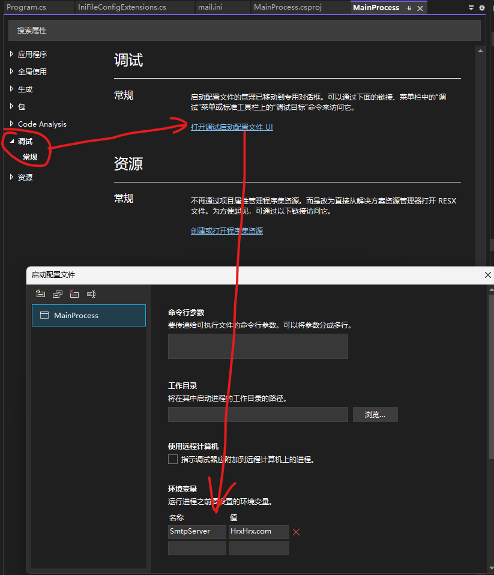

# 综合案例
- 本文使用一个含4种服务的综合案例来学习依赖注入
- 使用到的服务：
  1. `ConfigServices`: 配置服务，提供从环境变量和 ini 配置文件中读取配置的两种服务
  2. `LogServices`: 日志服务
  3. `MailService`: 邮件服务，提供发送邮件的服务(注：本服务需要读取配置和记录日志，因此需要包含上述两种服务)
  4. `ConfigReader`: 配置读取服务，提供类似集群环境下，从不同地方读取多个配置文件的服务

- 配置服务的接口及实现类：
```cs
public interface IConfigService
{
    public string? GetValue(string name);
}

//从 Environment 中读取配置文件的实现类
public class EnvConfigService : IConfigService
{
    public string? GetValue(string name) => Environment.GetEnvironmentVariable(name);
}

//从 ini 文件中读取配置的实现类
public class IniFileConfigService : IConfigService
{
    //文件路径
    public string? FilePath { get; set; }

    public string? GetValue(string name)
    {
        var kv = File.ReadAllLines(FilePath)
                .Select( x => new { Name = x.Split('=')[0], Value = x.Split("=")[1] })
                .SingleOrDefault(kv => kv.Name == name);

        return kv?.Value;
    }
}
```

- 日志服务的接口及实现类
```cs
public interface ILogPrivider
{
    public void LogError(string msg);

    public void LogInfo(string msg);
}

public class ConsoleLogPrivider : ILogPrivider
{
    public void LogError(string msg)
    {
        Console.WriteLine("Error: " + msg);
    }

    public void LogInfo(string msg)
    {
        Console.WriteLine("Info: " + msg);
    }
}
```

- 邮件服务的接口及实现类
```cs
public interface IMailService
{
    public void Send(string title, string targrt, string body);
}

public class MailService : IMailService
{
    //发邮件的服务中也需要记录日志以及读取配置，因此也注入日志服务
    private readonly ILogPrivider log;

    //1~2 原始模式，只读取单一环境下的配置文件，因此 IConfigService 即够用
    /*private readonly IConfigService config;

    public MailService(ILogPrivider log, IConfigService config)
    {
        this.log = log;
        this.config = config;
    }*/
    /*
     * 3.1 模拟集群环境时从不同地方读取多个配置文件的情况
     * 这里不再直接注入 IConfigService，而是利用 IConfigReader 来读取配置服务(该服务对象已实现读取全部配置文件的功能)
     */
    private readonly IConfigReader config;

    public MailService(ILogPrivider log, IConfigReader config)
    {
        this.log = log;
        this.config = config;
    }

    public void Send(string title, string targrt, string body)
    {
        this.log.LogInfo("准备发送邮件...");
        //模拟读取配置文件
        string? smtpServer = this.config.GetValue("SmtpServer");
        string? userName = this.config.GetValue("UserName");
        string? password = this.config.GetValue("Password");
        Console.WriteLine($"邮件服务器地址: {smtpServer} {userName} {password}");
        Console.WriteLine("发送邮件: " + title + " " + body);

        this.log.LogInfo("邮件发送完毕!");
    }
}
```

- 配置读取服务的接口及实现类
```cs
public interface IConfigReader
{
    /// <summary>
    /// 如果配置找不到，就返回 null
    /// </summary>
    /// <param name="name"></param>
    /// <returns></returns>
    public string? GetValue(string name);
}

internal class LayeredConfigReader : IConfigReader
{
    //用于装载所有提供配置服务的服务集合
    private readonly IEnumerable<IConfigService> services;

    public LayeredConfigReader(IEnumerable<IConfigService> services)
    {
        this.services = services;
    }

    public string? GetValue(string name)
    {
        string? value = null;
        foreach (var service in services)
        {
            string? newValue = service.GetValue(name);
            //逐层覆盖，取到最后一个不为 null 的值
            if (newValue != null)
            {
                value = newValue;
            }
        }

        return value;
    }
}
```

- 配置文件 `mail.ini`
```ini
SmtpServer=abc.mail.com
UserName=admin
Password=admin
```

### 1. 原始方法
- 使用框架提供的原始方法注册、使用服务，业务层仍需知道服务层的具体实现类的名称
- 业务层主程序：
```cs
ServiceCollection services = new ServiceCollection();

//1.1 使用 EnvConfigService 实现类，从环境中读取配置
services.AddScoped<IConfigService, EnvConfigService>();

//1.2 使用 IniFileConfigService 实现类，从 ini 文件中读取配置
/*
 * 注：为什么这里必须使用 Lambda 表达式传入实现类对象，而不能直接 new 一个实现类对象传入？
 * 原因： AddScoped 是在运行时才创建对象，因此这里不能静态地 new 一个实现类传入，而应该用回调函数，运行时动态地 new 实现类对象后传入
 */
services.AddScoped(typeof(IConfigService), _ => new IniFileConfigService() { FilePath = "mail.ini" });


//2.1 原始方法，业务层仍需知道服务层的具体实现类的名称
services.AddScoped<ILogPrivider, ConsoleLogPrivider>();

services.AddScoped<IMailService, MailService>();


using (ServiceProvider sp = services.BuildServiceProvider())
{
    //第一个根服务必须通过 ServiceLocator(服务定位器) 的方式注册，其引用的其他服务则可以自动注册 (后续学习可以省略这步)
    IMailService mailService = sp.GetRequiredService<IMailService>();
    mailService.Send("Hello", "34567@gov.coom", "What's up?");
}
```
### 2. 自定义扩展方法
- 给`Microsoft.Extensions.DependencyInjection`框架添加自定义的扩张方法，以方便义务层使用

1. 配置服务：
```cs
//注：这里将命名空间修改为依赖注入包的空间，相当于直接给依赖注入包添加扩展方法(目的是为了减少 using 引用)
namespace Microsoft.Extensions.DependencyInjection
{
    public static class IniFileConfigExtensions
    {
        public static void AddIniFileConfig(this IServiceCollection services, string filePath)
        {
            services.AddScoped(typeof(IConfigService), _ => new IniFileConfigService { FilePath = filePath });
        }

        public static void AddEnvFileConfig(this IServiceCollection services)
        {
            services.AddScoped<IConfigService, EnvConfigService>();
        }
    }
}
```

2. 日志服务：
```cs
//注：这里将命名空间修改为依赖注入包的空间，相当于直接给依赖注入包添加扩展方法(目的是为了减少 using 引用)
namespace Microsoft.Extensions.DependencyInjection;

public static class ConsoleLogExtensions
{
    //2.2 自定义扩展方法，调用这个方法可以直接以 ConsoleLogPrivider 这个实现类来提供服务
    public static void AddConsoleLog(this IServiceCollection service)
    {
        service.AddScoped<ILogPrivider, ConsoleLogPrivider>();
    }
}
```

3. 配置读取服务：
```cs
//注：这里将命名空间修改为依赖注入包的空间，相当于直接给依赖注入包添加扩展方法(目的是为了减少 using 引用)
namespace Microsoft.Extensions.DependencyInjection
{
    public static class LayeredConfigExtensions
    {
        public static void AddLayeredConfig(this IServiceCollection services)
        {
            services.AddScoped<IConfigReader, LayeredConfigReader>();
        }
    }
}
```

4. 业务层：调用扩展方法简化代码，不需要记服务层具体实现类的名称  
**注：若要模拟集群环境，则先做如下修改：**
   1. 把 1.1 services.AddScoped<IConfigService, EnvConfigService>() 这句代码放开，则现在可以从环境变量和 ini 配置文件两个地方读取配置
   2. 右键本项目 -> 属性 -> 调试 -> 打开调试启动配置文件UI -> 环境变量，添加 SmtpServer = HrxHrx.com
   3. 运行项目，此时项目会先后读取环境变量和 ini 文件中的 SmtpServer 属性配置，并保留最后一个不为空的配置  
   

- 业务层代码：
```cs
ServiceCollection services = new ServiceCollection();

/* 
 * 1.3 使用扩展方法
 * 注： 这两种服务的注册顺序会影响结果，根据 ConfigReader 中的逻辑，后注册者会覆盖前者
 */
services.AddIniFileConfig("mail.ini");
services.AddEnvFileConfig();

/*
 * 2.2 扩展方法，给 DependencyInjection 包下的 IServiceCollection 接口添加扩展方法，使得业务层可以 . 出对应的实现类服务
 * 补充：使用这种方法，可以将原接口的访问修饰符改回 internal，而不需要 public，从而将访问级别限制在其程序集内
 */
services.AddConsoleLog();

services.AddScoped<IMailService, MailService>();

/* 
 * 3.1 使用模拟集群环境时从不同地方读取多个配置文件的情况
 * 注：
 *      1. 把 1.1 services.AddScoped<IConfigService, EnvConfigService>() 这句代码放开，则现在可以从环境变量和 ini 配置文件两个地方读取配置
 *      2. 右键本项目 -> 属性 -> 调试 -> 打开调试启动配置文件UI -> 环境变量，添加 SmtpServer = HrxHrx.com
 *      3. 运行项目，此时项目会先后读取环境变量和 ini 文件中的 SmtpServer 属性配置，并保留最后一个不为空的配置
 */
services.AddLayeredConfig();

using (ServiceProvider sp = services.BuildServiceProvider())
{
    //第一个根服务必须通过 ServiceLocator(服务定位器) 的方式注册，其引用的其他服务则可以自动注册 (后续学习可以省略这步)
    IMailService mailService = sp.GetRequiredService<IMailService>();
    mailService.Send("Hello", "34567@gov.coom", "What's up?");
}

```