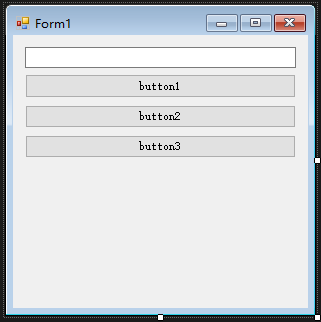
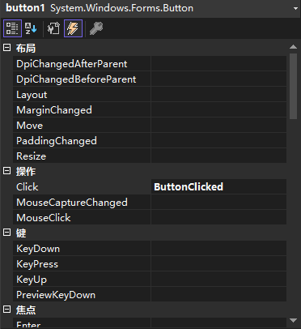
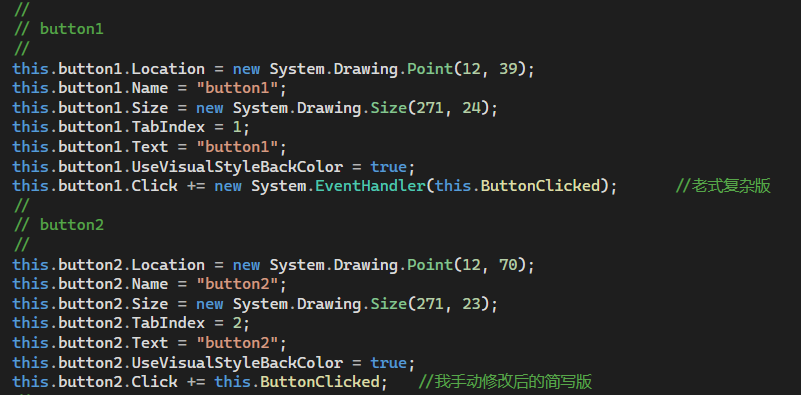

## 1.5_Winform事件案例_5



窗体中的 button1 和 Button2 都使用设计器自动挂载事件，Button3 待会儿手动挂载  


采用设计器自动挂载事件时，在Form1.Designer.cs文件中自动生成的代码：
- 需要注意的是，Button1 的挂载语句是是自动生成的老式代码，Button2 是改写后的简写版本  



后台代码：
```cs
public partial class Form1 : Form
{
    public Form1()
    {
        InitializeComponent();

        /*
        * 注：这里 button3 手写订阅关系，button1 和 button2 的订阅关系由 Form 设计器自动生成，源代码在 Form1.Designer.cs 文件里
        */
        //this.button3.Click += ButtonClicked;

        //用 -= 取消订阅事件
        //this.button3.Click -= new EventHandler(this.ButtonClicked);

        //老式挂载事件处理器的写法
        //this.button3.Click += new EventHandler(this.ButtonClicked);

        //老式委托挂载事件处理器的写法
        /*this.button3.Click += delegate (object sender, EventArgs e) {
            this.textBox1.Text = "haha!";
        };*/
        
        //Lambda表达式 + 匿名委托挂载事件处理器的写法
        this.button3.Click += (sender, e) =>
        {
            this.textBox1.Text = "hoho!";
        };
    }

    private void ButtonClicked(object sender, EventArgs e)
    {
        if(sender == this.button1)
        {
            this.textBox1.Text = "Hello!";
        }

        if(sender == this.button2)
        {
            this.textBox1.Text = "World!";
        }

        if(sender == this.button3)
        {
            this.textBox1.Text = "Mr.Okay!";
        }
    }
}
```
