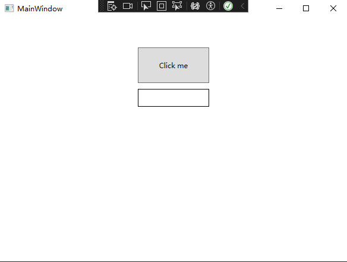
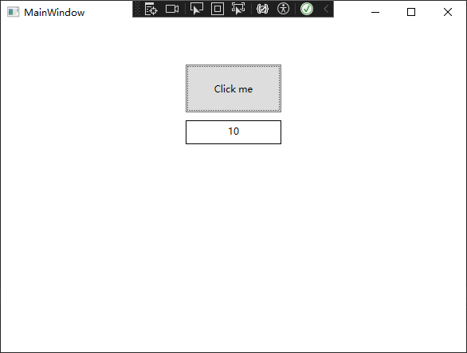
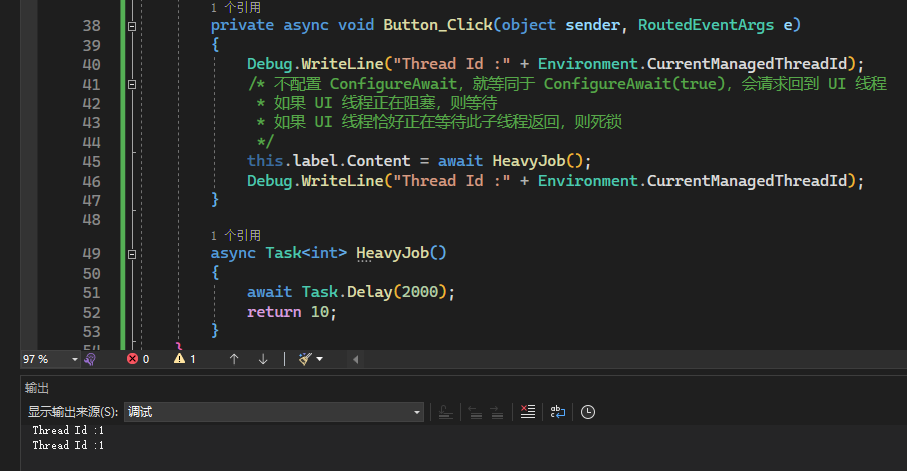
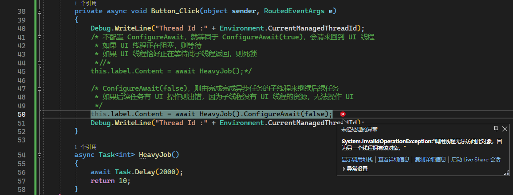
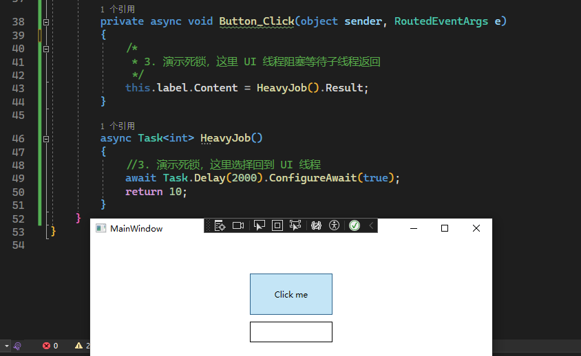
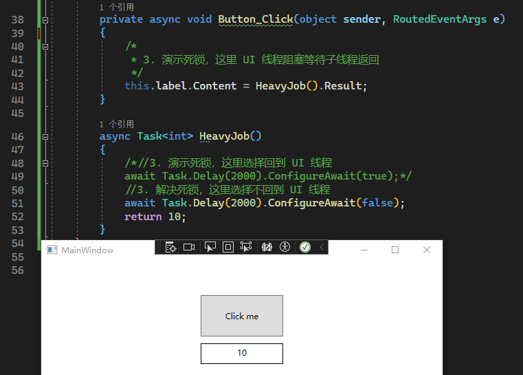
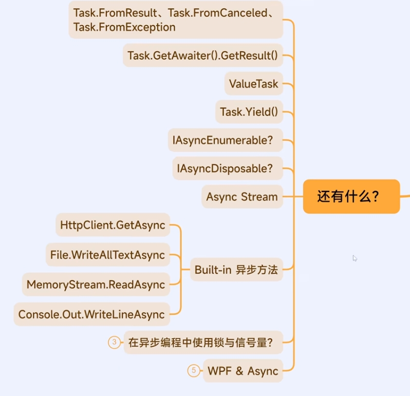

# .Net 异步
## 1 基本概念
### 1.1 异步与多线程
**已经有多线程了，为何还要异步？**  
1. 多线程与异步时不同的概念
    - 异步不意味着多线程，单线程同样可以异步，如使用操作系统的时间片
    - 异步默认借助线程池(可以不用)
    - 多线程经常使用阻塞，而异步要求不阻塞
2. 多线程与异步的适用场景不同
    1) 多线程：
        - 适合CPU密集型操作、长期运行的任务
        - 提供更底层的控制，如操作线程、锁、信号量等
        - 
        - 线程的创建与销毁开销较大
        - 线程不易于传参的返回
        - 线程的代码书写较为繁琐
    2) 异步
        - 适合IO密集型操作、短暂小任务
        - 避免线程阻塞，提高系统响应能力

### 1.2 任务(Task)
**什么是异步任务(Task)？**
1. Task 是一个引用类型，其包含了异步任务的各种状态
   - 正在运行、完成、结果、报错等
   - 另有 ValueTask 值类型版本 
2. Task 可以看成是实现异步编程的最小模块，把一个大任务分割成多个小任务，每一个小任务交给一个 Task 来解决，且主线程不会阻塞
3. 获取结果(如异步已完成的信号)后回到之前的工作
---

**任务的结果**  
返回的对象也是一个 `Task`  
    - 若返回值是无泛型 `Task` 则表示异步任务没有返回值  
    - 若返回值是 `Task<T>` 则表示有类型为 T 的返回值

### 1.3 异步任务(async Task )
#### 1.3.1 async 关键字
**常见误区：对于一个 Task 方法，并不是必须被 async 标记后才能被 await**  
- 只要一个方法的返回值是 Task，即使没被 async 标记，它仍是一个异步方法，仍表示一项异步操作，可以被 await 等待。
```cs
async Task Main()
{
    //FooAsync 方法的返回类型是 Task，是异步操作，因此就可以 await 等待
    await FooAsync();
}

Task FooAsync()
{
    return Task.Delay(1000);
}
```
- 用 async 标记一个 Task 方法，只是为了可以在**该方法内**使用 await，以此可以等待其他异步操作
```cs
async Task Main()
{
    //这里其实也用到了异步 Main 方法，Main 方法没被 async 标记的话，也不能使用 await
    //FooAsync 方法的返回类型是 Task，是异步操作，因此就可以 await 等待
    await FooAsync();
}

async Task FooAsync()
{
    //FooAsync 被 async 标记后，即可在其内部使用 await
    await Task.CompletedTask;  
}
```

#### 1.3.2 await 关键字
- 使用 await 关键字并不是将主线程阻塞，然后等待异步结果回来后继续
- 实际每次遇到 await 时都会切换线程，原线程跳出，新线程等待异步结束
- **因此，如果在 async 方法里不使用 await，那这实际上就是同步任务(由主线程全干完)，一旦有阻塞，那就等于主线程就被阻塞**
代码示例：
```cs

Helper.PrintThreadId("Before", "Main");
await FooAsync();
Helper.PrintThreadId("After", "Main");

async Task FooAsync()
{
    Helper.PrintThreadId("Before", "FooAsync");
    await Task.Delay(1000);
    Helper.PrintThreadId("After", "FooAsync");
}

class Helper
{
    //用于记录这是第几次输出
    private static int index = 1;

    public static void PrintThreadId(string? message = null, string? name = null)
    {
        string title = index + ": " + name;
        if (!string.IsNullOrEmpty(message))
        {
            title += " @ " + message;
        }
        //输出当前线程的 Id
        Console.WriteLine(title + "  线程Id：" + Environment.CurrentManagedThreadId);
        Interlocked.Increment(ref index);
    }
}
```
> 输出结果为：  
> 1: Main @ Before  线程Id：1  
> 2: FooAsync @ Before  线程Id：1  
> 3: FooAsync @ After  线程Id：4  
> 4: Main @ After  线程Id：4  
> *可见，开启异步任务和等待异步任务结束的不是同一个线程*

**注：由于本例使用的是控制台应用，而控制台应用没有同步上下文机制，因此异步任务结束后，并没有回到原线程(如结果4，线程Id还是4，而不是1)。**  
- 详见[1.5同步上下文机制](#15-同步上下文)，Winforms 或 WPF 程序可通过配置`ConfigureAwait()`来选择是否切换回原线程，不配置的话默认是 true，即切换回原线程。

**对于有返回值的异步任务：**
```cs
//异步，不阻塞地拿到返回值
int result = await GetValueAsync();

//这种方法会阻塞
//int result = GetValueAsync().Result;

async Task<int> GetValueAsync()
{
    await Task.Delay(1000);
    return 24;
}
```

#### 1.3.3 状态机(async、await 组合)
**async 关键字的实质就是为了能在被其标记的方法内使用 await 关键字，来完成异步操作**  
- async 和 await 组合能把方法改写成状态机，本质上并没有改变方法的返回值
- aysnc 只是开启改写状态机的符号，编译后的代码其实仍然是正常的 Task
- await 负责切换状态机的状态

#### 1.3.4 async void
1. 同样是状态机，但其返回的不是 Task 对象，因此无法像操作 Task 一样操作这种方法
2. 无法传递异常，需要在异步任务内处理异常
```cs
try
{
    //VoidAsync();          //捕获不到异常
    await TaskAsync();      //可以正常捕获 AggregateException
    //TaskAsync().GetAwaiter().GetResult();     //可以捕获未被包装的异常 Exception，而不会将异常包装成 AggregateException ，一般不建议这样做
}
catch (Exception ex)
{
    Console.WriteLine(ex);
}

// async void 不会对异常进行包装
async void VoidAsync()
{
    await Task.Delay(1000);
    throw new Exception("Something was wrong!");
}

//async Task 会对任务内部的异常进行包装，然后可以传递出去
async Task TaskAsync()
{
    await Task.Delay(1000);
    throw new Exception("Something was wrong!");
}
```

3. async void 几乎只用于事件的注册，比如 WPF 里的 Loaded、Click 事件等
```cs
public partial class MainWindow : Window
{
    public MainWindow()
    {
        InitializeComponent();
    }

    /* 窗体加载事件，使用异步加载法
    * 这样就只能写 async void，而不能用 async Task 了
    * 注意：因为 async void 不能传递异常，因此要在异步任务内谨慎处理异常
    */
    private async void Window_Loaded(object sender, RoutedEventArgs e)
    {
        //do something
    }
}
```

#### 1.3.5 异步编程具有传染性(Contagious)
- 一处 async，处处 async
- 不用太过担心，因为几乎所有自带方法都提供了异步的版本[详见]() 
- 即使是已写好的同步任务，也可以使用 `Task.Run` 将其包装成异步方法，详见[2.1.1 Task.Run](#211-taskrun)
- 对于 WPF 的事件也可以用 `async void` 的方式注册成异步事件
- 一发即忘，详见[1.6 一发即忘(Fire and forget)](#16-一发即忘fire-and-forget)
```xml
<StackPanel Margin="50">
    <Button Width="120"
            Height="60"
            Content="Click me" 
            Click="Button_Click"/>
    <Label Name="label"
            Width="120"
            Height="30" 
            Margin="10"
            VerticalAlignment="Center"
            HorizontalContentAlignment="Center"
            BorderBrush="Black"
            BorderThickness="1"/>
</StackPanel>
```
```cs
private async void Button_Click(object sender, RoutedEventArgs e)
{
    this.label.Content = await HeavyJob();
}

async Task<int> HeavyJob()
{
    await Task.Delay(2000);
    return 10;
}
```


### 1.4 重要思想：不阻塞
#### 1.4.1 为什么不要阻塞异步任务
1. 不要在异步方法中使用阻塞的形式，否则会使异步方法失去意义。而使用`await`，才充分体现了状态机这个特性。
2. `await`会释放当前线程，而不是阻塞当前线程
3. 此外，在同步任务中我们一般用`Thread.Sleep()`让任务暂停（阻塞线程），而在异步任务中我们一般用`await Task.Delay()`让任务暂停（原线程释放，新线程等待），这也是不阻塞思想的一种体现

#### 1.4.2 常见阻塞情形
1. `Task.Wait() & Task.Result()`：阻塞当前线程，等待任务完成，可能造成死锁
   - `Task.GetAwaiter().GetResult()`：详见[1.3.4的代码](#134-async-void)，与前两者的区别只是不会将 Exception 包装成 AggregateException
2. `Task.Delay() && Thread.Sleep()`：前者是一个异步任务，会立即释放当前线程；后者会阻塞当前线程
3. IO 等操作的同步方法
   - 通常可以找到对应的异步操作版本，如果找不到则可用`Task.Run`对其进行包装。详见[2.1.1 Task.Run](#211-taskrun)
4. 其他繁重且耗时的任务（如极多次的循环）
   - 通常可以找到对应的异步操作版本，如果找不到则可用`Task.Run`对其进行包装。详见[2.1.1 Task.Run](#211-taskrun)

### 1.5 同步上下文
* 概念：一种管理和协调线程的机制，允许开发者将代码的执行切换到特定线程。**上下文**即开启异步任务前的运行环境(是否同步上下文就如同：异步任务完成后是否回到原线程)
* WinForms 与 WPF 拥有同步上下文(UI线程)，而控制台程序没有

#### 1.5.1 ConfigureAwait
1. `ConfigureAwait(true / false)`：配置任务通过 `await` 方法结束后是否回到原来的线程，不配置默认为 true，即切换回原线程。(一般只有 UI 线程采取这种策略)  

> 如图所示，`await`前后的 ThreadId 都为 1

2. 使用 ConfigureAwait 时需注意：  
   1)  如果配置成`ConfigureAwait(false)`，则后续有 UI 操作则会报错，因为不回到 UI 线程的话不能操作 UI 资源  
   
   2)  `ConfigureAwait(true)`就像一种请求，需要等待原线程空闲时才能继续。因此，如果主线程阻塞等待子线程返回，而子线程配置了`ConfigureAwait(true)`以等待主线程空闲时才能返回，则这样就会造成死锁  
   - 
   - 
   
#### 1.5.2 TaskScheduler
1. 配置 Task 的调度方式和运行线程等
   - 是否是线程池线程 `Default`
   - 当前线程 `CurrentThread`
   - 单线程上下文 `STAThread`
   - 长时间运行线程 `LongRunning`(如这个任务需要运行很长时间，则可以考虑将其标记为`LongRunning`，防止长时间不复用，以致线程池耗尽)
2. 配置优先级、上下文、执行状态等

### 1.6 一发即忘(Fire and forget)
概念：即只调用一个异步方法，但是不使用`await`或阻塞的方式去等待它的结束 (只管开头，不管结尾)
* 可能造成的后果：无法获得返回结果；无法观察任务状态，不知道是否完成、是否报错等

## 2 简单任务
### 2.1 如何创建异步任务  
#### 2.1.1 Task.Run
- 经典方式，略
- 此外还可以将同步任务套一层，包装成异步任务
```cs
Console.WriteLine("当前线程ID：" + Environment.CurrentManagedThreadId);
int res = await Task.Run(HeavyJob);
Console.WriteLine(res);

//HeavyJob 原本是一个同步任务，使用 Task.Run 包装后变成异步任务，因此任务内外的线程 Id 不同

/*
 * 模拟一个耗时较长的同步任务
 */
int HeavyJob()
{
    Thread.Sleep(3000);
    Console.WriteLine("当前线程ID：" + Environment.CurrentManagedThreadId);
    return 10;
}
```
#### 2.1.2 Task.Factory.StartNew()
- 实际上是 Task.Run 的完整版，含16种重载（Task.Run含8种重载）
- 提供更多的功能，如将任务标记成长时间运行线程：`Task.CreationOptions.LongRunning`

#### 2.1.3 new Task + Task.Start()
- 类似于多线程里的 `new Thread()`、`Thread.Start()`，唯一作用就是先创建一个任务，不马上执行，等需要时再执行。这种情况很少遇到。

### 2.2 如何开启多个异步任务
1. 创建多个异步任务，如 Task 集合
2. 给每个 Task 添加任务
```cs
var inputs = Enumerable.Range(1, 10).ToArray();

//创建一个 Task 集合
List<Task<int>> tasks = new();

/*//遍历 Task 集合，给每个 Task 添加 HeavyJob 任务
foreach (var input in inputs)
{
    tasks.Add(HeavyJob(input));
}*/

// LINQ简化语法：
tasks = inputs.Select(HeavyJob).ToList();

/* 调用 .Result 时，如果任务没完成，则阻塞主线程，等待任务完成拿到结果后再继续
 * 这种阻塞方式不太好，因此在调用前加上一句 await Task.WhenAll()，即可异步地等待所有任务完成
 * 这样，再调用 .Result 时，因为所有任务都已完成，所以不会阻塞
 * 
 * 此外还有 Task.WhenAny()：任何一个任务完成就结束等待
 */
await Task.WhenAll(tasks);
var outputs = tasks.Select(x => x.Result).ToArray();

//打印结果
foreach(var output in outputs)
{
    Console.WriteLine(output);
}

async Task<int> HeavyJob(int input)
{
    //模拟耗时操作
    await Task.Delay(2000);
    return input * input;
}
```

### 2.3 如何取消异步任务
1. `CancellationTokenSource` + `CancellationToken`：创建异步任务时带上 CancellationToken 参数，利用这个参数取消任务
```cs
//声明一个 CancellationTokenSource，用于取消异步任务
CancellationTokenSource cts = new();

try
{
    //创建异步任务时带上 CancellationToken 参数
    Task task = Task.Delay(100000, cts.Token);

    //2秒后取消异步任务
    Thread.Sleep(2000);
    cts.Cancel();

    await task;
}
catch (TaskCanceledException)   //异步任务被取消时会抛出异常
{
    Console.WriteLine("Task canceles");
}
finally
{
    // CancellationTokenSource 类实现了 IDisposable 接口，是可以被释放的，因此使用完记得释放
    cts.Dispose();
}
```

2. `OperationCanceledException` & `TaskCanceledException`
- 两种不同的异常，后者继承前者，详见[**两种异常的区别**](如何取消异步任务.md/#41-两种异常的区别)

1. 推荐所有异步方法都带上 CancellationToken 参数(框架提供的异步方法也都带了 -> 我可以不用，但你不能没有)

### 2.x 其他
1. 任务超时如何实现？
2. 在异步任务中汇报进度？
3. 如何在同步方法中调用异步方法？
* 以上问题篇幅过长，不在此介绍。详见[**如何取消异步任务.md**](如何取消异步任务.md/#如何取消异步任务)

## 3 常见误区
### 3.1 异步编程不必需要多线程来实现
#### 3.1.1 时间片轮转调度法实现异步
#### 3.1.2 单线程上使用异步 I/O 或事件驱动的编程模型(EAP)
- EAP：Event—based Asynchronous Pattern
- 比如委托除了可以用`Invoke`来同步调用，也可以使用`BeginInvoke`来异步调用

#### 3.1.3 单/多线程上异步的区别
- 单线程异步：设置定时器，时间结束前可以先去做别的事情，时间结束后再来做这个任务
- 多线程异步：将任务交给不同的线程，并有自己来进行指挥调度

### 3.2 异步方法不一定要写成 async Task，有 async Task 也不一定是异步任务
[详见1.3 异步任务async-task](#13-异步任务async-task)
- `async` 关键字只是配合 `await` 使用，从而将方法包装成状态机，本质上仍然是`Task`，`async Task`返回值仍然是`Task`，`async void`返回值仍然是`void`。
- 同样，如果只有`async`，而没有`await`，那实际上就是原线程从头干到底，并没有异步操作

**注：接口里无法声明成`async Task`，而只能写`Task`，至于实现类则可以任选**

### 3.3 await 不一定会切换同步上下文
- 在使用`await`关键字调用并等待一个异步任务时，异步任务不一定会立刻来到新线程上
- 如果`await`了一个已经完成的任务(包括`Task.Delay(0)`)，会直接得到结果

### 3.4 Task.Result 不一定会阻塞当前线程
- 同3.3，如果任务已完成，那么`Task.Result`可以直接得到结果
- [示例见 2.2 如何开启多个异步任务](#22-如何开启多个异步任务)

### 3.5 异步不可以全面取代多线程
- 异步与多线程是两个概念，有一定联系，但并不能完全相互替代

### 3.6 开启的异步任务也有可能阻塞主线程
**前文说过，开启异步任务后，并没有立刻切换到子线程，而是由主线程继续干活，直到遇到`await`后才交由子线程执行。**
- 因此，如果在`await`前将线程阻塞(包括`Thread.Sleep(0)`)，都会阻塞主线程
- [详见 1.3.2 await 关键字](#132-await-关键字)
- 将任务放在`Task.Run()`内，才可以保证异步任务在不同线程上执行，才不会阻塞主线程

## 4 同步机制
**异步编程中有哪些同步机制？(即限制同时可运行的线程数量)**
### 4.1 原生方法中仅有`SemaphoreSlim`适用
```cs
/*
 * 本例用于演示在异步编程中的同步操作
 * 即有时需要限制同时可运行的线程数量
 *      1. 如爬虫反封，每次只开启少数线程，
 *      2. 如考虑线程安全问题，只允许单线程操作共享资源
 */

int[] inputs = Enumerable.Range(1, 10).ToArray();

//设置初始线程为2，且最大线程数为2
SemaphoreSlim sem = new(2, 2);

//给每个 Task 添加 HeavyJob 任务
List<Task<int>> tasks = inputs.Select(HeavyJob).ToList();

await Task.WhenAll(tasks);
var outputs = tasks.Select(x => x.Result).ToArray();

//打印结果
foreach (var output in outputs)
{
    Console.WriteLine(output);
}

async Task<int> HeavyJob(int input)
{
    //等待信号量，因为创建 SemaphoreSlim 时设置了信号量上限为2，因此只有两个线程能抢到信号量并开始干活
    await sem.WaitAsync();

    await Task.Delay(1000);

    //释放信号量，释放完后其他线程才能获取信号量从而开始干活
    sem.Release();

    return input * input;
}
```

- 多线程中的传统方法如 Lock(Monitor)、Mutex、Semaphore、EventWaitHandle、ManualResetEventSlim 等由于都是阻塞的，因此不适用于异步编程

### 4.2 第三方库
- `Microsoft.VisualStudio.Threading`库中的`AsyncManualResetEvent`
- `Nito.AsyncEx`库中的`AsyncLock`
- 有兴趣可以了解，暂略

## 5 其他

- 静候更新