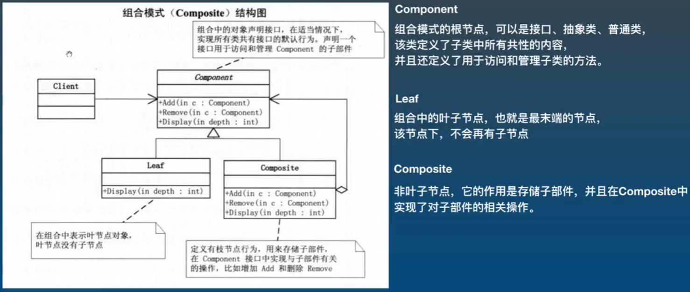

## 组合设计模式

组合设计模式: 可以使用它将对象组合成树状结构, 并且能像使用独立对象一样使用他们



1. 使用场景:
- 程序中需求部分 - 整体结构, 并且希望可以忽略单个对象和组合对象的不同, 统一地使用组合结构中的所有对象时使用  
2. 例如:
- WPF开发中, 所有控件都继承自 System.Windows.Controls.Control 这个抽象类, 控件共有的属性: Template、共有的方法: Focus()等

3. 案例: 使用组合设计模式模拟公司的层级架构
- 公司下面是部门, 部门下面是部门或员工

```cs
static void Main(string[] args)
{
    //Component 根节点    公司
    //Composite 树枝      部门
    //leaf      树叶      员工

    //创建一个公司节点 --> 不需要另外搞一个公司类, 可以把公司看成最大的一个部门, 因此也用部门类创建
    Component component = new DepartComposite("上市大公司");

    //创建部门
    Component dep1 = new DepartComposite("总裁办");

    //创建员工
    Component boss = new Emplyee("孙全");

    //把部门添加到公司下
    component.Add(dep1);
    //把员工添加到部门下
    dep1.Add(boss);

    //打印效果 --> 只需打印根节点  -->  传入的3其实是打印时的 ' - ' 数量
    component.Display(3);

}

/*
* 注: 这里用抽象类比接口更好
* 因为父类中有很多成员需要子类去继承
*/
public abstract class Component
{
    public string Name { get; }

    public Component(string name)
    {
        this.Name = name;
    }

    public abstract void Add(Component component);
    public abstract void Remove(Component component);
    public abstract void Display(int depth);
}

/// <summary>
/// 部门类 --> 树枝
/// </summary>
public class DepartComposite : Component
{
    //继承父类的构造方法, 用于注入 name
    public DepartComposite(string name) : base(name) {}

    //存储部门或者员工
    private List<Component> listComponent = new List<Component>();

    public override void Add(Component component)
    {
        listComponent.Add(component);
    }

    public override void Remove(Component component)
    {
        listComponent.Remove(component);
    }

    public override void Display(int depth) 
    {
        Console.WriteLine(new string('-', depth) + this.Name);

        foreach(var item in listComponent)
        {
            //用到了递归思想  -->  因为没办法一开始就知道一共有多少层
            item.Display(depth + 4);
        }
    }
}

/// <summary>
/// 员工类 --> 树叶, 树叶无法继续添加或删除子集
/// </summary>
public class Emplyee : Component
{
    //继承父类的构造方法, 用于注入 name
    public Emplyee(string name) : base(name) { }

    //树叶节点不能添加也不能删除, 因此这里只继承, 不实现
    public override void Add(Component component)
    {
        throw new NotImplementedException();
    }

    public override void Remove(Component component)
    {
        throw new NotImplementedException();
    }

    public override void Display(int depth)
    {
        Console.WriteLine(new string('-', depth) + this.Name);
    }
}
```