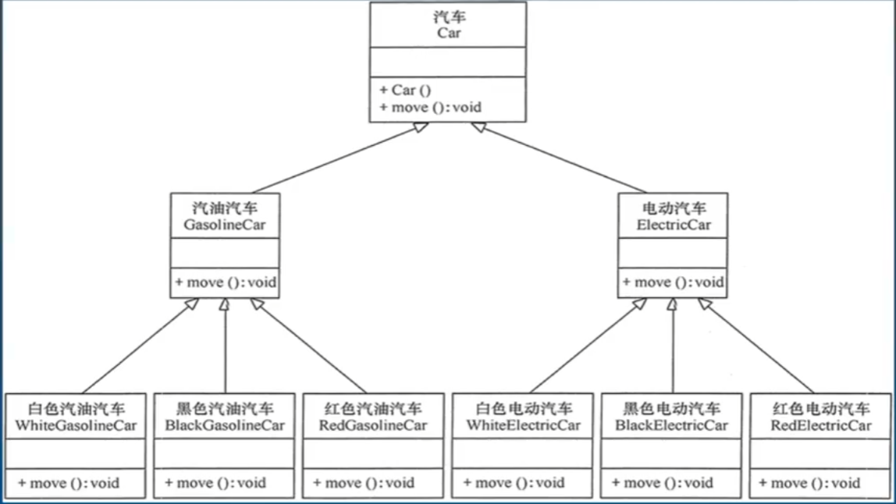
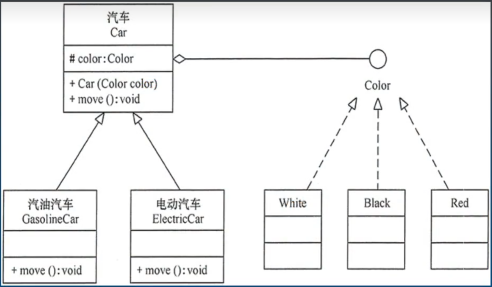
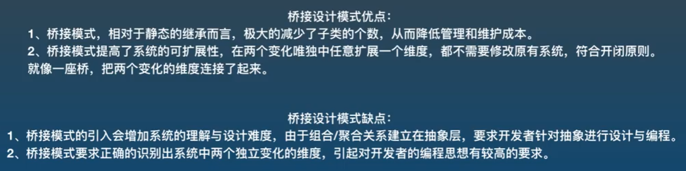

## 桥接设计模式

桥接设计模式其实就是合成复用原则的具体落地
- 将已有对象纳入到新对象中, 作为新对象的对象成员来实现, 新独享可以调用已有对象的功能, 从而达到复用







```cs
static void Main(string[] args)
{
    Car gasolineCar = new GasolineCar();
    gasolineCar.Move(new Red());

    Car electricCar = new ElectricCar();
    electricCar.Move(new White());
}

public interface IColor
{
    string ShowColor();
}

public class Red : IColor
{
    public string ShowColor()
    {
        return "红色";
    }
}

public class White : IColor
{
    public string ShowColor()
    {
        return "白色";
    }
}

public class Black : IColor
{
    public string ShowColor()
    {
        return "黑色";
    }
}

/*
 * 注: 这里一般写抽象类而不写接口
 * 因为抽象类中可以存放属性、字段, 子类可以继承这些属性、字段, 而接口中不行
 * 依赖注入的三种方法, 接口只能使用参数注入法, 而抽象类还可以使用构造注入法和Set注入法
*/
public abstract class Car
{
    public abstract void Move(IColor color);
}

//汽油汽车
public class GasolineCar : Car
{
    public override void Move(IColor color)
    {
        Console.WriteLine(color.ShowColor() + "颜色的汽油汽车在行驶");
    }
}

//电动汽车
public class ElectricCar : Car
{
    public override void Move(IColor color)
    {
        Console.WriteLine(color.ShowColor() + "颜色的电动汽车在行驶");
    }
}
```