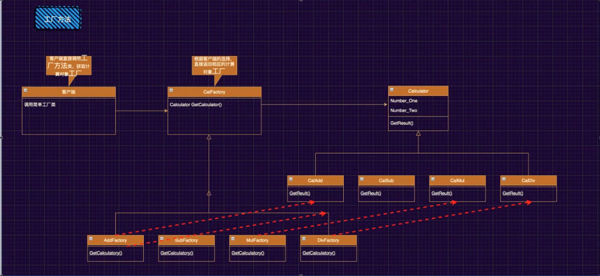

## 工厂设计模式



**原本只有一个工厂, 现在有几种业务就有几种工厂**
- 第一步: 拿到对应的工厂对象
- 第二步: 通过工厂对象拿到业务对象
- 第三步: 通过业务对象完成业务

**仍然存在的缺陷:**  
: 客户端调用时还是有大量的Switch语句

```cs
static void Main(string[] args)
{
    //写一个简单的项目, 来实现计算器加减乘除功能

    //4个对象: 加减乘除

    Console.WriteLine("请输入操作数1: ");
    double d1 = Convert.ToDouble(Console.ReadLine());

    Console.WriteLine("请输入操作数2: ");
    double d2 = Convert.ToDouble(Console.ReadLine());

    Console.WriteLine("请输入操作符: ");
    string oper = Console.ReadLine();

    /*
    * 原本只有一个工厂, 现在有几种业务就有几种工厂
    * 第一步: 拿到对应的工厂对象
    * 第二步: 通过工厂对象拿到业务对象
    * 第三步: 通过业务对象完成业务
    */
    ICalFactory calFactory = null;
    switch(oper)
    {
        default:
        case "+":
            calFactory = new AddFactory();
            break;
        case "-":
            calFactory = new SubFactory();
            break;
        case "*":
            calFactory = new MulFactory();
            break;
        case "/":
            calFactory = new DivFactory();
            break;
    }
    ICaculator caculator = calFactory.GetCalculator();
    Console.WriteLine(caculator.GetResult(d1, d2));
}

/*
* 1. 创建对象的所有逻辑都集合在一个方法中, 风险比较高
* 2. 现在是抽象依赖的细节, 不符合依赖倒置原则, 我们需要让细节依赖抽象
*/
/*
public class CalFactory
{
    public static ICaculator GetCalculator(string oper)
    {
        ICaculator caculator = null;
        switch (oper)
        {
            default:
            case "+":
                caculator = new Add();
                break;
            case "-":
                caculator = new Sub();
                break;
            case "*":
                caculator = new Mul();
                break;
            case "/":
                caculator = new Div();
                break;
        }
        return caculator;
    }
}
*/

//1. 把创建对象的这件事封装成抽象
public interface ICalFactory
{
    ICaculator GetCalculator();
}

public class AddFactory : ICalFactory
{
    public ICaculator GetCalculator()
    {
        return new Add();
    }
}

public class SubFactory : ICalFactory
{
    public ICaculator GetCalculator()
    {
        return new Sub();
    }
}

public class MulFactory : ICalFactory
{
    public ICaculator GetCalculator()
    {
        return new Mul();
    }
}

public class DivFactory : ICalFactory
{
    public ICaculator GetCalculator()
    {
        return new Div();
    }
}


public interface ICaculator
{
    //方法: 能够返回最终计算的结果
    double GetResult(double d1, double d2);
}

public class Add : ICaculator
{
    public double GetResult(double d1, double d2)
    {
        return d1 + d2;
    }
}

public class Sub : ICaculator
{
    public double GetResult(double d1, double d2)
    {
        return d1 - d2;
    }
}

public class Mul : ICaculator
{
    public double GetResult(double d1, double d2)
    {
        return d1 * d2;
    }
}

public class Div : ICaculator
{
    public double GetResult(double d1, double d2)
    {
        return d1 / d2;
    }
}

```