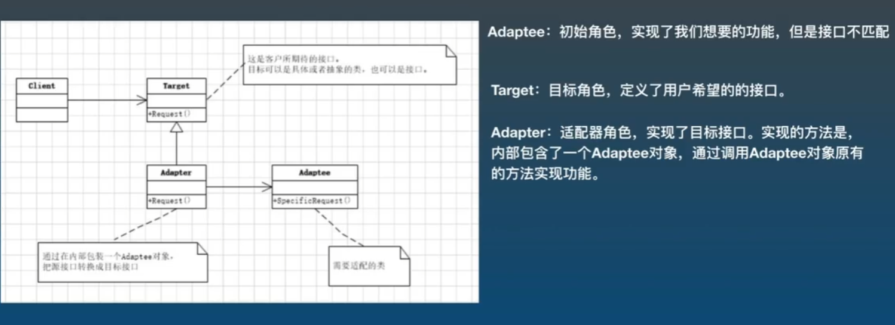

## 适配器设计模式



1. 适配器的优点:
- 更好的复用性  -->  如果功能已经存在, 只是接口不兼容, 通过适配器模式就可以让这些功能得到更好的复用
2. 适配器的缺陷:
- 由于Adapter的存在, 会提高系统复杂度

```cs
static void Main(string[] args)
{
    //创建适配器
    IChargeable chargeAdapter = new PhoneChargeAdapter();
    chargeAdapter.IPhoneCharge();       //表现在适配器上的苹果口, 给苹果手机用 (内部转换成了安卓充电头, 但用户不需要知道内部实现, 只需要把苹果插口连上就行)

    chargeAdapter.AndroidCharge();      //同上, 给安卓手机的充电口 (内部转换成了苹果头)
}

//安卓充电头
public class AndroidChargeAdaptee
{
    public void AndroidCharge()
    {
        Console.WriteLine("安卓充电头充电");
    }
}

//苹果充电头
public class IPhoneChargeAdaptee
{
    public void IPhoneCharge()
    {
        Console.WriteLine("苹果充电头充电");
    }
}


public interface IChargeable
{
    //安卓手机的充电接口
    void AndroidCharge();

    //苹果手机的充电接口
    void IPhoneCharge();
}

//适配器转接口
public class PhoneChargeAdapter : IChargeable
{
    //在Adapter当中, 封装了一个Adaptee对象, 这个对象才是实现功能的对象
    private AndroidChargeAdaptee androidAdaptee = new AndroidChargeAdaptee();
    private IPhoneChargeAdaptee iPhoneAdaptee = new IPhoneChargeAdaptee();

    public void IPhoneCharge()
    {
        //给苹果头调用的方法, 内部转换成了安卓头
        androidAdaptee.AndroidCharge();
    }

    public void AndroidCharge()
    {
        //给安卓头调用的方法, 内部转换成了苹果头
        iPhoneAdaptee.IPhoneCharge();
    }
}
```

