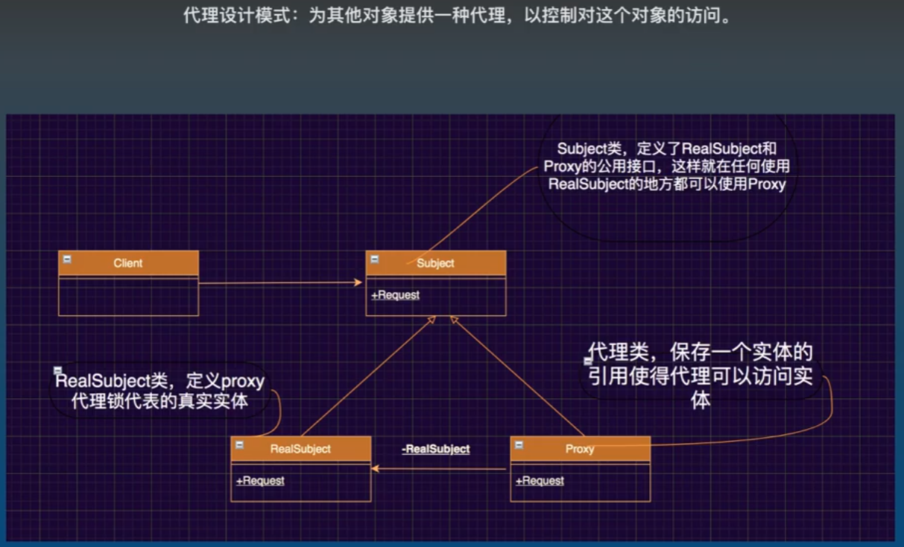

## 代理设计模式

思想: 为其他对象提供一种代理, 以控制对这个对象的访问



- 注: 下方示例只简单用到了代理, 没有控制访问权限
- 详见: [代理设计模式应用](./2.0_代理设计模式应用.md "控制访问权限的示例")

```cs
static void Main(string[] args)
{
    //创建班花对象
    ClassFlower classFlower = new ClassFlower();
    classFlower.Name = "韩梅梅";

    //创建代理对象
    ISubject subject = new Proxy(new RealSubject(classFlower));

    subject.GiveSmoking();
    subject.GiveBeer();
    subject.GiveJK();
}

public class ClassFlower
{
    public string Name { get; set; }
}

/// <summary>
/// 规范接口, 干活类和代理类都需要实现, 起到规范作用, 任何需要干活类的地方都能传入代理类
/// </summary>
public interface ISubject
{
    void GiveSmoking();
    void GiveBeer();
    void GiveJK();
}    

/// <summary>
/// 真正干活的类
/// </summary>
public class RealSubject : ISubject
{
    private ClassFlower classFlower;

    public RealSubject(ClassFlower classFlower)
    {
        this.classFlower = classFlower;
    }

    public void GiveBeer()
    {
        Console.WriteLine(this.classFlower.Name + "同学, 请你喝酒!");
    }

    public void GiveJK()
    {
        Console.WriteLine(this.classFlower.Name + "同学, 请你JK!");
    }

    public void GiveSmoking()
    {
        Console.WriteLine(this.classFlower.Name + "同学, 请你抽烟!");
    }
}

/// <summary>
/// 代理类, 内部注入 RealSubject 类, 干活时调用 RealSubject 的方法,让 RealSubject 真正干活
/// </summary>
public class Proxy : ISubject
{
    private RealSubject realSubject;
    public Proxy(RealSubject realSubject)
    {
        this.realSubject = realSubject;
    }

    public void GiveBeer()
    {
        this.realSubject.GiveBeer();
    }

    public void GiveJK()
    {
        this.realSubject.GiveJK();
    }

    public void GiveSmoking()
    {
        this.realSubject.GiveSmoking();
    }
}
```