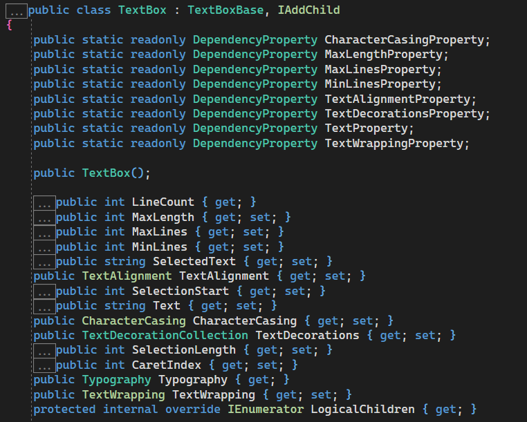
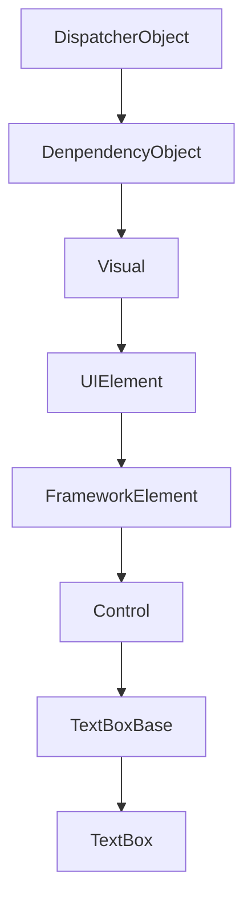
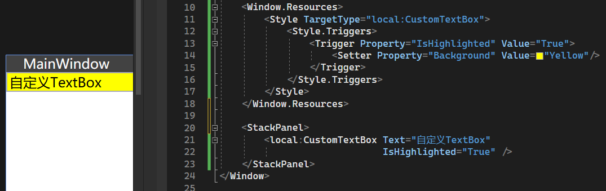
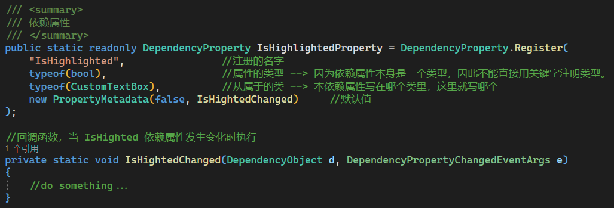
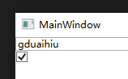
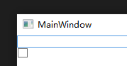
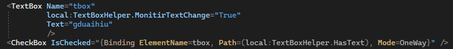
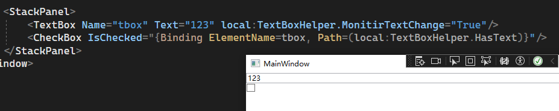
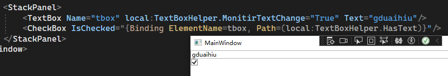

## 1. 依赖属性 Dependenvy Property
### 1.1 原理

#### 1.1.1 依赖属性是静态只读的，例如:  

*可见 TextBox 内部既有名为 Text 的普通属性，又有名为 TextProperty 的静态只读依赖属性*
- 将依赖属性存成静态的原因：如果全是普通属性，那所有控件一起都将有极多没有用上的属性，耗费资源
---

#### 1.1.2 依赖属性只能存在于 `DenpendencyObject` 中(原因见下)

`DenpendencyObject` 继承关系如下图所示，以 `TextBox` 控件为例

- 可见，WPF 控件都继承了`DenpendencyObject`，且各自拥有大量的依赖属性
---


### 1.2  语法

#### 1.2.1 一般可以写自定义控件类继承自某一系统控件如：`class CustomTextBox : TextBox`
```cs
public partial class MainWindow : Window
{
    public MainWindow()
    {
        InitializeComponent();

        CustomTextBox box = new();
        //使用封装的简便赋值法
        box.IsHighlighted = false;
        //不使用封装的原始赋值法
        box.SetValue(CustomTextBox.IsHighlightedProperty, true);
    }
}

internal class CustomTextBox : TextBox
{
    /// <summary>
    /// 其实是对依赖属性的一层封装，提供对依赖属性的简便访问方式
    /// </summary>
    public bool IsHighlighted
    {
        /*
        * 注意这里用到的 GetValue 和 SetValue 方法，是属于 DependencyObject 基类的。
        * 这就是为什么依赖属性只能存在于 DependencyObject 内部，不然就用不了这两个方法
        */
        get { return (bool)GetValue(IsHighlightedProperty); }
        set { SetValue(IsHighlightedProperty, value); }
    }

    /// <summary>
    /// 依赖属性
    /// </summary>
    public static readonly DependencyProperty IsHighlightedProperty = DependencyProperty.Register(
        "IsHighlighted",                //注册的名字
        typeof(bool),                   //属性的类型 --> 因为依赖属性本身是一个类型，因此不能直接用关键字注明类型。
        typeof(CustomTextBox),          //从属于的类 --> 本依赖属性写在哪个类里，这里就写哪个
        new PropertyMetadata(false)     //默认值
    );
}
```
---

#### 1.2.2 在`new PropertyMetadata()`时可以传入回调函数，当这个依赖属性发生变化时执行
```cs
/// <summary>
/// 依赖属性
/// </summary>
public static readonly DependencyProperty IsHighlightedProperty = DependencyProperty.Register(
    "IsHighlighted",                //注册的名字
    typeof(bool),                   //属性的类型 --> 因为依赖属性本身是一个类型，因此不能直接用关键字注明类型。
    typeof(CustomTextBox),          //从属于的类 --> 本依赖属性写在哪个类里，这里就写哪个
    new PropertyMetadata(false, IsHightedChanged)     //默认值
);

//回调函数，当 IsHighted 依赖属性发生变化时执行
private static void IsHightedChanged(DependencyObject d, DependencyPropertyChangedEventArgs e)
{
    //do something...
}
```

#### 1.2.3 只读依赖属性的写法
* 其实就是再给依赖属性封装一层
  * 注意：
    * 1.要用到静态构造来赋值
    * 2.注册时使用的是RegisterReadOnly
```cs
//依赖属性
public static readonly DependencyProperty HasTextProperty;
//DependencyPropertyKey 用于封装依赖属性(给依赖属性再套一层壳)
public static readonly DependencyPropertyKey HasTextPropertyKey;

/* 要在类的静态构造里对 DependencyPropertyKey 进行赋值
 * 
 * 因为类创建后 HasTextPropertyKey 还是 null，因此不能直接赋给 HasTextProperty，需要先在静态构造中把自己注册出来才能赋给别人
 */
static CustomTextBox()
{
    //注：此处不再是 Register 而是 RegisterReadOnly
    HasTextPropertyKey = DependencyProperty.RegisterReadOnly(
        "HasText",
        typeof(bool),
        typeof(CustomTextBox),
        new PropertyMetadata(false)
    );
    //再将套壳的数据真正赋给依赖属性 DependencyProperty
    HasTextProperty = HasTextPropertyKey.DependencyProperty;
}

//最后再用普通属性给依赖属性封装一下，简化读取操作
public bool HasText => (bool)GetValue(HasTextProperty);
```

### 1.3 简单使用示例

*这里使用的是 Style Trigger 法，更多方法详见第 3 章*

---
## 2. 附加属性 Attach Property
* 附加属性对比依赖属性的优势：
  * 我们无法直接给系统控件添加依赖属性，只能另写一个子类继承，然后添加到子类里面(兴师动众)
  * 部分属性不专属于某控件，而具有通用性，如：`Grid.Row` `DockPanel.Dock`等，不适用依赖属性

### 2.1 原理
与依赖属性基本相同，只是由于没有继承 `DependencyObject`，因此需要用依赖反转思想

### 2.2 语法
#### 2.2.1 后台语法与依赖属性类似
```cs
internal class TextBoxHelper
{
    /*
    * 注：因为附加属性可以添加到多种控件上，所以在自定义时尚不知道要用在哪个控件上，因此用到依赖反转
    *     在参数中传入 DependencyObject，然后调用这个 DependencyObject 的 GetValue 和 SetValue 即可
    */
    public static string GetTitle(DependencyObject obj)
    {
        return (string)obj.GetValue(TitleProperty);
    }

    public static void SetTitle(DependencyObject obj, string value)
    {
        obj.SetValue(TitleProperty, value);
    }

    public static readonly DependencyProperty TitleProperty =
        DependencyProperty.RegisterAttached(    //与依赖属性不同的地方：这里是 RegisterAttached
            "Title", 
            typeof(string), 
            typeof(TextBoxHelper), 
            new PropertyMetadata("")
        );
}
```
#### 2.2.2 前台语法：(Path = 的括号里那一句)：
```xml
<!--这是刚才写依赖属性时自定义的控件-->
<!--注意在最后 Path= 的时候，要用括号，否则识别不到附加属性-->
<local:CustomTextBox local:TextBoxHelper.Title="this is title"
                     Text="{Binding RelativeSource={RelativeSource Self},Path=(local:TextBoxHelper.Title)}"/>

<Label local:TextBoxHelper.Title="我是一个使用了TextBoxHelper.Title的Label"
       Content="{Binding RelativeSource={RelativeSource Self},Path=(local:TextBoxHelper.Title)}"/>
```

#### 2.2.3 只读附加属性的写法
套层套层，详见 4

---
## 3. 两种属性的使用方法
共含有四种：
    1. Style + Trigger 关注依赖(附加)属性
    2. 在注册，传入`new PropertyMetadata`参数时可以传入一个回调函数，在回调函数中直接使用
    3. 在2的基础上，在回调函数中挂载事件，进而
### 3.1 Style + Trigger 法：


### 3.2 回调函数法：


### 3.3 回调函数 + 事件法：


### 3.4 MVVM 模式绑定法：和普通属性一样，略

## 4. 实战
### 4.1 依赖属性实战
后台代码：由于附加属性的代码基本是在依赖属性上做改动，所以略  

前台代码：如图中的 local:CustomTextBox，就是个自定义控件，导入命名空间后像普通控件一样使用即可


### 4.2 附加属性实战
实现这样的功能：当 TextBox 不为空时，CheckBox 自动勾选上，为空时不勾  



使用附加属性 HasText，这样前台的 CheckBox 就可以监控 TextBox 的 Text 了，如图：


**注意：**
不能直接给 HasText 的回调函数挂载事件处理器，因为 HasText 的值发生改变时又会触发该事件处理器，循环调用。因此需要再套一层依赖属性(HasTextMonitor)

HasText 依赖属性的代码，因为要实现只读，所以套了一层 Key
```cs
/*
* 注：
*     1. 因为附加属性可以添加到多种控件上，所以在自定义时尚不知道要用在哪个控件上，因此用到依赖反转
*        在参数中传入 DependencyObject，然后调用这个 DependencyObject 的 GetValue 和 SetValue 即可
*     2. 如果要指定只能附加到某个控件上，则只能把 DependencyObject 改成该控件
*/
public static bool GetHasText(DependencyObject obj)
{
    return (bool)obj.GetValue(HasTextProperty);
}

protected static void SetHasText(DependencyObject obj, bool value)
{
    //注意这里是 Key 而不是 DP
    obj.SetValue(HasTextPropertyKey, value);
}

public static readonly DependencyProperty HasTextProperty;
/*
* 类似于依赖属性，再套一层 key 即可
* 类创建时 Key 还是 null 因此同样要在静态构造中将 Key 赋给 HasTextProperty
* 
* 注意：因为已经改成只读了，所以对于 Set 包装器有两种处理方法
*      1. 直接删除，要赋值时使用原始方法，对 Key 赋值
*      2. 修饰改成 protected 并且改成对 Key 赋值而非直接对 DenpendencyProperty 赋值
*/
public static readonly DependencyPropertyKey HasTextPropertyKey =
    DependencyProperty.RegisterAttachedReadOnly(    
        "HasText",
        typeof(bool),
        typeof(TextBoxHelper),
        new PropertyMetadata(false)
    );
//静态构造
static TextBoxHelper()
{
    HasTextProperty = HasTextPropertyKey.DependencyProperty;
}
```

HasTextMonitor 依赖属性(用于监控 HasText 值的变动)的代码
```cs
public static bool GetMonitorTextChange(DependencyObject obj)
{
    return (bool)obj.GetValue(MonitorTextChangeProperty);
}

public static void SetMonitorTextChange(DependencyObject obj, bool value)
{
    obj.SetValue(MonitorTextChangeProperty, value);
}

public static readonly DependencyProperty MonitorTextChangeProperty =
    DependencyProperty.RegisterAttached(
        "MonitorTextChange",
        typeof(bool),
        typeof(TextBoxHelper),
        new PropertyMetadata(false, MonitorTextChangedPropertyChanged)
    );

private static void MonitorTextChangedPropertyChanged(DependencyObject d, DependencyPropertyChangedEventArgs e)
{
    if (d is not TextBox box)
        return;

    //如果 e 的值为 true，即在前台设置 Monitor 的值为 true，则挂载事件
    if ((bool)e.NewValue)
    {
        box.TextChanged += Box_TextChanged;
        /*
        * 法一：这是只读时，直接删除 Set 包装器的写法，直接对 Key 赋值
        */
        //box?.SetValue(HasTextPropertyKey, !string.IsNullOrEmpty(box.Text));
        /*
        * 法二：使用修改成 Key 的Set 包装器
        */
        SetHasText(box!, !string.IsNullOrEmpty(box!.Text));
    }
    //前台设置为 false，卸载事件
    else
    {
        box.TextChanged -= Box_TextChanged;
    }
}

private static void Box_TextChanged(object sender, TextChangedEventArgs e)
{
    //前面已经做了判断，box 肯定是 TextBox ，且不为 null，因此这里直接转
    var box = sender as TextBox;
    /*
    * 法一：这是只读时，直接删除 Set 包装器的写法，直接对 Key 赋值
    */
    //box?.SetValue(HasTextPropertyKey, !string.IsNullOrEmpty(box.Text));
    /*
    * 法二：使用修改成 Key 的Set 包装器
    */
    SetHasText(box!, !string.IsNullOrEmpty(box!.Text));
}
```

前端代码：
```xml
<StackPanel>
    <TextBox Name="tbox" 
             local:TextBoxHelper.MonitirTextChange="True" 
             Text="gduaihiu"/>
    <CheckBox IsChecked="{Binding ElementName=tbox, Path=(local:TextBoxHelper.HasText), Mode=OneWay}" />
</StackPanel>
```

**要点：**
  1. 给 DP 多套了层 Key
  2. 把 DP 设置成了只读属性(前端注意绑定方式设为OneWay)  
  3. 因为在前端代码中，Text属性可能在 Monitir 监视器前面，从而在编译时Text已有值，而后添加监视器，导致监视器未能检测到初始值。因此在挂载事件处理器时应主动调用一次 SetHasText()  

BUG如下图所示：


